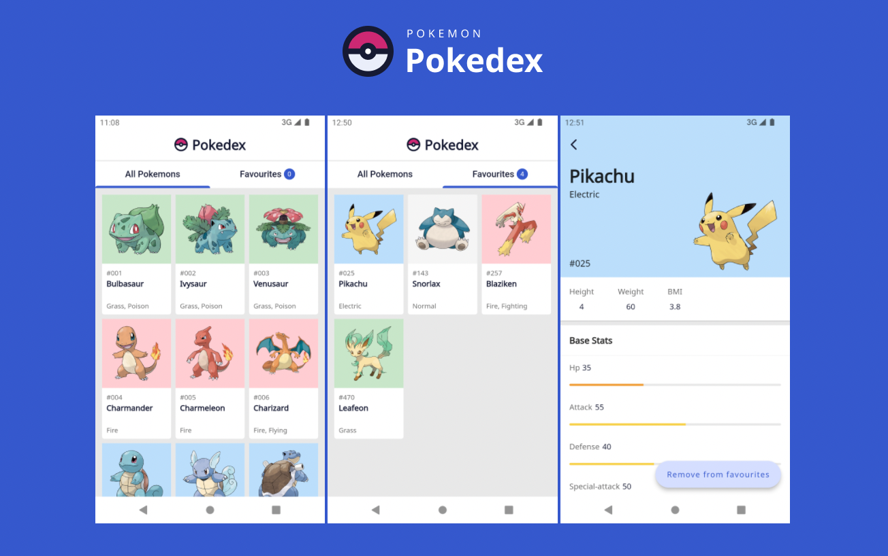
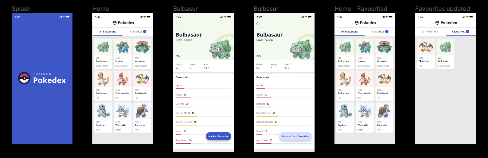
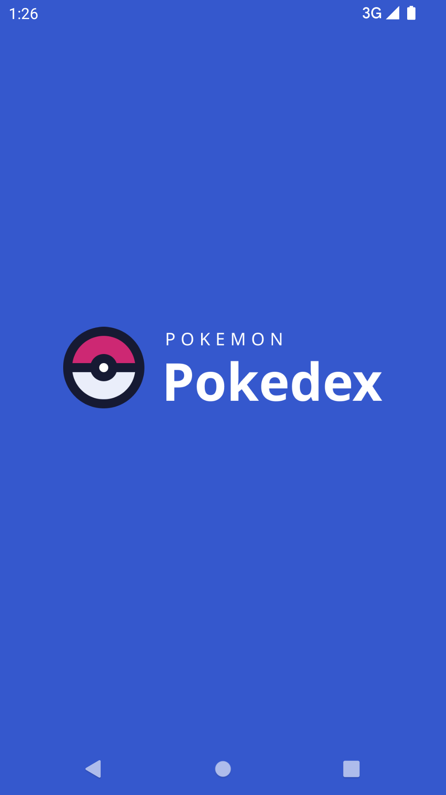
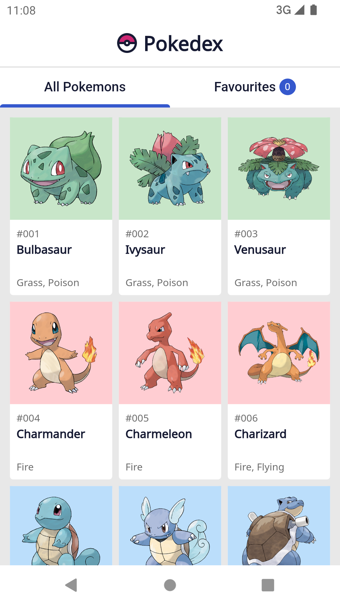
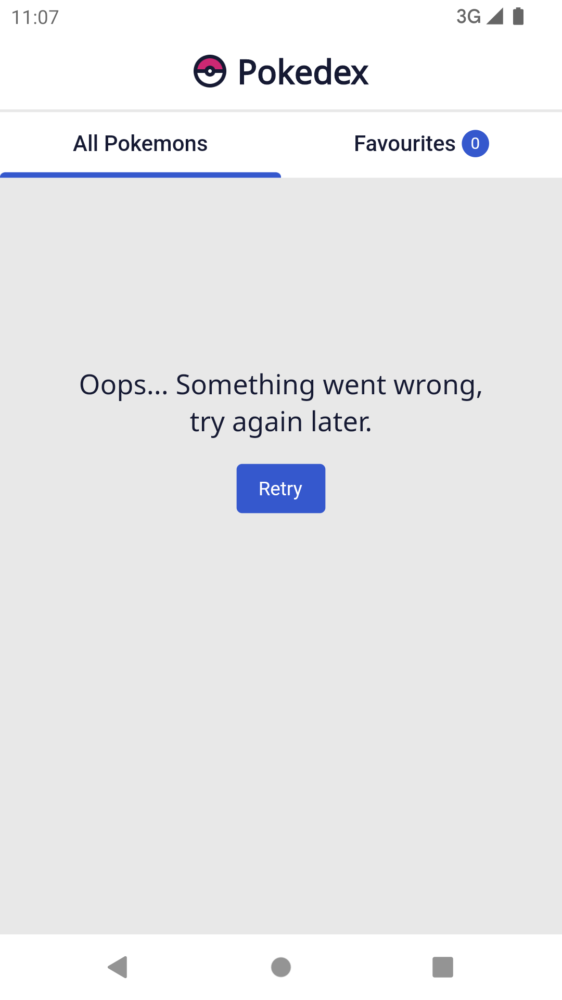
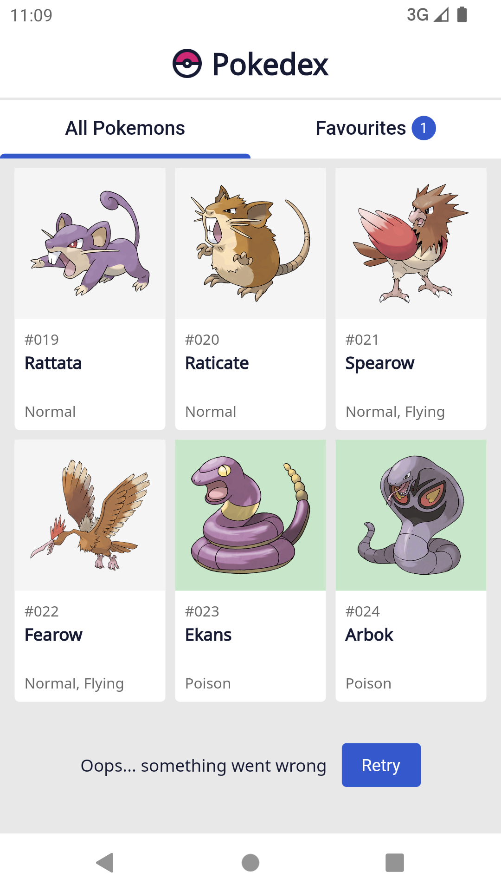
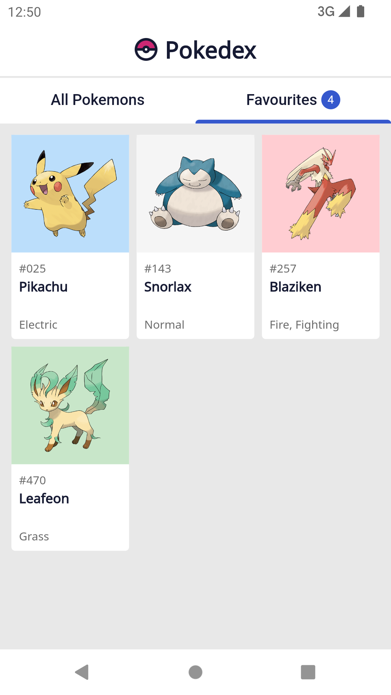
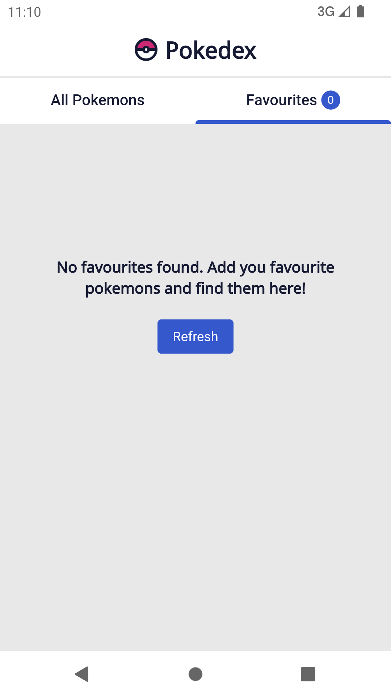
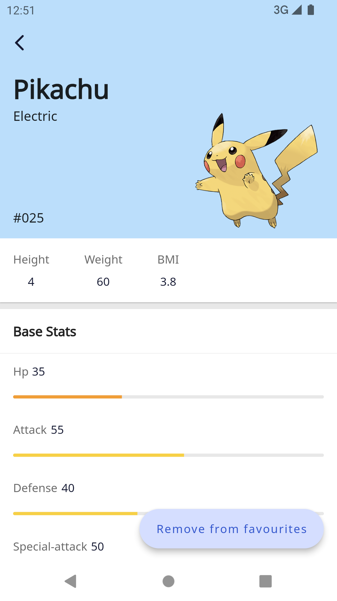
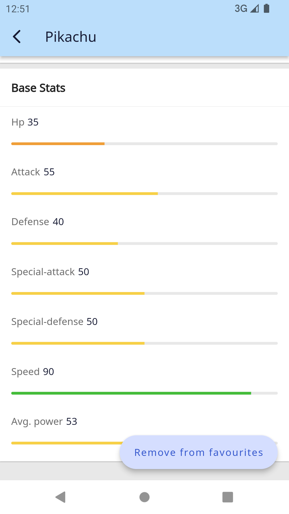

# Pokedex
Pokedex demonstrates modern Flutter development with Clean Architecture, Bloc for state management, Widget reusability, Unit Testing with Mockito, Error Handling, and more! 

    

        
    

## Key Points kept in mind while development

- Code Readability
- Reusable widget usage
- Unit Testing where needed
- Good State Management
- UI matching the original designs
- UI for various screen sizes
- Error handling
- Empty data handling

## Technologies - Architectures - Libraries

- Clean Architecture.
- Bloc for State Management.
- Repository and Datasources Pattern.
- Grid Pagination.
- Mockito in Unit Testing .
- Get-it for Dependency Injection.
- Dio for network calls.
- Shared Preferences for caching.

## Figma Designs

- You can access to the designs of the application from this [Figma link](https://www.figma.com/file/vP3TT058xIqpOv5zv7cUg9/Pokedex-Assessment?node-id=32%3A83).
- You need to have a Figma account to see the all details.
- You can click the **Present** button from top right, to see different flows.
- You can use the static assets in the designs, if required.

## Features Implemented

### Splash Screen

  - Shown for a brief moment while application is starting.

  

### All Pokemons Tab
  - The Pokemons are fetched from this API: https://pokeapi.co
  - Pagination is used since there are lots of Pokemons to be listed coming from API.
  - All Pokemons are listed on this tab.
  - Progress indicators are used while Pokemons are being fetched.
  - Background colors are determined from the Pokemon's type, each mapped to a specific color.

  
  
  

### Favourites Tab
  - When a Pokemon is marked as favourite by clicking **Mark as favourite** button on the **Pokemon details page**, it should be shown on this tab.
  - The number of Pokemons marked as favourite are shown near the tab's text.
  - Pokemons that are marked as favourite are persistent is stored on disk. So, after a Pokemon is marked as favourite, it should still be shown under **Favourites** tab even after application is closed and started again.

  
  

### Pokemon Details Page
  - BMI is calculated using this formula: **weight / (height^2)** without caring any units.
  - **Avg. Power** under **Base stats** is calculated using formula: **(Hp + Attack + Defense + Special Attack + Special Defense + Speed) / 6**
  - **Remove from favourites** button removes the related Pokemon from the list shown on **Favourites** tab.
  - Bars colors under **Base stats** are determined by the their magnitudes. 

  
  

